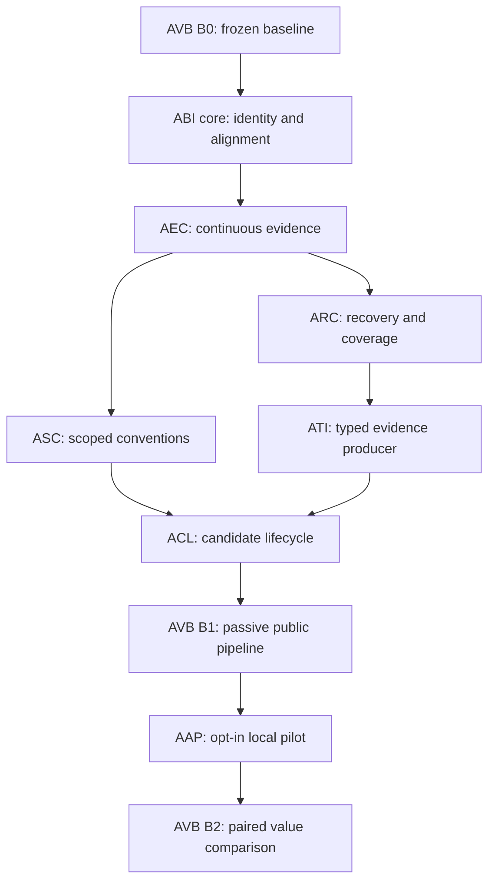

# AEL value delivery

## Status

Proposed, 2026-09-29. Eight Draft specifications and eight proposed implementation plans respond to the registered-project audit and source assessment. No implementation approval or milestone completion is recorded here. The user requested the specs and plans together; their preparation does not waive the approval gate before execution.

The intended outcome is an attributable, complete and reviewable path from retained operation evidence to scoped knowledge, followed by a controlled demonstration of its use in another session. Increasing the number of lessons is not an acceptance criterion.[^basis]

## Delivery units

| ID | Priority | Scope | Specification | Proposed plan | Approval / execution |
|---|---|---|---|---|---|
| ABI | P0 | Build identity and installation alignment | [Spec](../superpowers/specs/2026-09-29-ael-build-identity-design.md) | [Plan](../superpowers/plans/2026-09-29-ael-build-identity.md) | Not recorded / not started |
| AEC | P0 | Result facts and resumed evidence continuity | [Spec](../superpowers/specs/2026-09-29-ael-evidence-continuity-design.md) | [Plan](../superpowers/plans/2026-09-29-ael-evidence-continuity.md) | Not recorded / not started |
| ARC | P0 | Bounded recovery and scoped coverage | [Spec](../superpowers/specs/2026-09-29-ael-recovery-coverage-design.md) | [Plan](../superpowers/plans/2026-09-29-ael-recovery-coverage.md) | Not recorded / not started |
| ASC | P1 | Explicit conventions and subproject scope | [Spec](../superpowers/specs/2026-09-29-ael-scoped-conventions-design.md) | [Plan](../superpowers/plans/2026-09-29-ael-scoped-conventions.md) | Not recorded / not started |
| ATI | P1 | Typed evidence from a public producer | [Spec](../superpowers/specs/2026-09-29-ael-typed-evidence-ingestion-design.md) | [Plan](../superpowers/plans/2026-09-29-ael-typed-evidence-ingestion.md) | Not recorded / not started |
| ACL | P1 | Candidate review, lifecycle and retrieval | [Spec](../superpowers/specs/2026-09-29-ael-candidate-lifecycle-design.md) | [Plan](../superpowers/plans/2026-09-29-ael-candidate-lifecycle.md) | Not recorded / not started |
| AAP | P1 | Default-off local advisory pilot | [Spec](../superpowers/specs/2026-09-29-ael-advisory-pilot-design.md) | [Plan](../superpowers/plans/2026-09-29-ael-advisory-pilot.md) | Not recorded / not started |
| AVB | P0 baseline, P1 comparison | End-to-end value benchmark | [Spec](../superpowers/specs/2026-09-29-ael-value-benchmark-design.md) | [Plan](../superpowers/plans/2026-09-29-ael-value-benchmark.md) | Not recorded / not started |

Each specification contains problem, evidence, goals, exclusions, observable behavior, architecture, lifecycle, failure/privacy rules, rollout and numbered acceptance criteria. Each plan names source/test files, TDD steps, regression commands and rollback evidence. The [traceability manifest](ael-value-delivery-traceability.json) maps 46 requirements to 46 tasks and planned tests. A planned test path is not a claim that the test exists or passes.

## Order and dependencies

### Selected first delivery

The user selected working analysis as the first value objective and explicitly included ARC in the initial scope. Deliver AVB-B0 baseline capture, ABI core, AEC and ARC in that order. Complete the deferred ABI receipt-provenance acceptance with ARC. This records the selected delivery scope; implementation and acceptance results remain unrecorded.

The first delivery covers all five registered projects from the audit: AEL, sisterhood, wkregukobiet, SecondBrain and vimeo-downloader. Qualify each installation with a controlled new session and a resumed session. For each, trace admission, committed logical evidence, scheduled detector work and completed analysis. Reports must distinguish evaluated-no-findings, insufficient-evidence, unsupported input and failed or incomplete analysis. A completed job alone is not proof of an eligible detector evaluation.

Historical coverage is part of acceptance. Freeze a per-project retained-input watermark before reconciliation; inventory pending and quarantined delivery records separately. Preview and recover only eligible selected records, then reconcile missing analysis through that watermark. Every retained item in the declared historical scope must be accounted for as processed or explicitly unresolved with its reason and next recovery condition. Missing source evidence must not be invented, and unresolved records must not be reported as analyzed. Record the remaining gap per project; zero unexplained omissions is required, while zero unrecoverable records is not promised.

Repeat recovery and reconciliation to demonstrate idempotency, preserve original quarantine provenance, and verify bounded retries. The acceptance report must include before/after counts, actual build identity, input watermark, detector version, result state and remaining exclusions for each project. ASC, ATI, ACL and advisory delivery remain subsequent scope; this first delivery does not claim new lesson types or demonstrated reuse.

Start with AVB task 1 before repairing the measured behavior. ABI tasks 1–4 and the writer/admission portion of task 5 then unblock AEC. ABI receipt persistence acceptance closes with ARC task 4; ABI must not be marked fully accepted before that integration passes. This is a staged integration edge, not a requirement to complete ARC before starting AEC.

After AEC, ASC is independent of ARC in product terms, but shared file ownership still requires serialization. ATI consumes AEC and ARC. ACL consumes ASC and ATI. Complete B1 before enabling AAP; then run B2. B2 is not a prerequisite for starting AAP. Only B0 is a prerequisite for all comparisons.

One implementer owns shared edits to `src/cli.ts`, `src/storage/experience-store.ts`, `src/learning/service.ts`, `src/learning/repository.ts` and retrieval at any time. If parallel work is explicitly authorized, use separate worktrees, assign files and integration ownership before starting, and serialize shared-file merges.

## Scope decisions for review

The proposed first producer for typed task evidence is a bounded, explicit local annotation import. It proves the production path without claiming that native hooks supply verification they do not expose. User-declared and agent-declared evidence retain their origins. Native mappings require actual qualified structured source examples.

The first advisory channel is agent-invoked CLI retrieval in a controlled Codex scenario. It is off by default and separate from enforcement. Actionable entries require verified lifecycle, resolved scope and fresh context. The pilot covers an explicit tooling convention and a fact newly acquired in session A and used in session B. The latter prevents measuring only repetition of existing instructions.

The proposed benchmark requires at least five paired repetitions per scenario and condition, a correct task outcome, and at least one fewer redundant operation in the median advisory run than the matched disabled baseline. These are proposed thresholds, not measured results or statistical significance claims. Wrong-scope guidance, secret persistence, passive intervention and unapproved promotion each fail the run. Missing cost telemetry prevents a net-cost benefit claim.

Proposed bounds include four automatic recovery attempts per generation, 100 records per explicit recovery plan, 1024 logical evidence entries per page, 128 typed annotation records / 256 KiB per import, and three advice entries / 4096 UTF-8 bytes / 200 ms lookup budget. Approval must explicitly accept or revise these limits before implementation.

## Relation to existing milestones

ABI addresses installation differences not represented by package version alone. AEC and ARC close observed gaps in the reliable-observation and worker paths, rather than declaring M4–M6 absent. ASC and ATI extend the supported evidence path. ACL joins existing candidate and knowledge stores without weakening lifecycle rules.

AAP proposes a limited local delivery slice before full cloud/SSO M7, recorded in proposed ADR 002. It does not replace the full M8 scope, change approved runtime authority or complete M9. Existing M7–M9 dependencies remain authoritative until the amendment is approved. AVB begins measurement early while preserving the full cross-agent benchmark as later work.[^milestones]

RAG, additional reviewers, broad cloud/SSO integration and new enforcement are outside this package. Admission performance is measured in ASC/AVB; no unmeasured speedup is promised.

## Approval and execution gates

- [ ] Record approval of each selected specification, including scope, limits, migration and evidence policy.
- [ ] Record the decision on [ADR 002](../decisions/002-staged-local-knowledge-reuse.md) before AAP implementation.
- [ ] Review the corresponding proposed plan against the approved contract and current source; expand code-level patches after that review, before execution.
- [ ] Capture B0 and preserve its immutable build/corpus/environment identities before product changes.
- [ ] Execute the selected plan in dependency order; keep incomplete host qualifications explicit.
- [ ] Run its full acceptance path after the last change and attach actual requirement-level evidence.
- [ ] Review the implementation, migration and rollback outcomes before recording acceptance or rollout.

Source/test paths in plans distinguish existing files from proposed modules. Commands in specs are proposed interfaces and must not be presented as available in the current CLI. Hook installation, trust, migration, recovery and advisory enablement remain separate concrete operations; approval of a document alone does not claim they have occurred.

[^basis]: [Audit](../analysis/2026-09-29-ael-records-and-lessons.md), [verified findings](../analysis/2026-09-29-ael-value-findings.md), [improvement proposal](../sdd/proposals/2026-09-29-ael-value-delivery.md), [requirements](requirements.md).
[^milestones]: [Roadmap](roadmap.md), [operational memory index](operational-memory-milestones.md), [proposed staged reuse ADR](../decisions/002-staged-local-knowledge-reuse.md).
