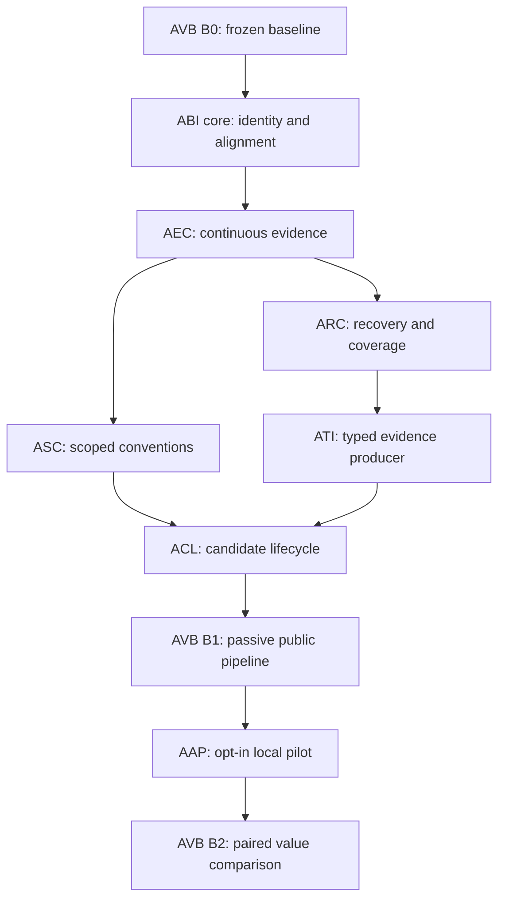

# AEL value delivery

## Status

ABI implementation was authorized by the user on 2026-09-29. The user accepted its verified core on 2026-09-29 before real-host qualification. On 2026-09-30 the user authorized implementation of all eight AEL specifications and requested subagents. Work proceeds in isolated worktrees with explicit file ownership. No additional acceptance or live rollout is recorded here.

On 2026-09-29, the user accepted the controlled process-interruption test as sufficient evidence for ABI-A3 lock recovery. This decision does not approve rollout or complete the remaining ABI acceptance work.

The intended outcome is an attributable, complete and reviewable path from retained operation evidence to scoped knowledge, followed by a controlled demonstration of its use in another session. Increasing the number of lessons is not an acceptance criterion.[^basis]

## Delivery units

| ID | Priority | Scope | Specification | Plan | Approval / execution |
|---|---|---|---|---|---|
| ABI | P0 | Build identity and installation alignment | [Spec](../superpowers/specs/2026-09-29-ael-build-identity-design.md) | [Plan](../superpowers/plans/2026-09-29-ael-build-identity.md) | Core accepted 2026-09-29; per-operation capture and retry receipt attribution tested; real-host qualification unsupported |
| AEC | P0 | Result facts and resumed evidence continuity | [Spec](../superpowers/specs/2026-09-29-ael-evidence-continuity-design.md) | [Plan](../superpowers/plans/2026-09-29-ael-evidence-continuity.md) | Logical index, pagination, late result and migration tests integrated; real host envelopes unqualified |
| ARC | P0 | Bounded recovery and scoped coverage | [Spec](../superpowers/specs/2026-09-29-ael-recovery-coverage-design.md) | [Plan](../superpowers/plans/2026-09-29-ael-recovery-coverage.md) | Recovery plans, reconciliation, receipts and health v3 tested; orphaned unprocessed stream coverage remains unavailable |
| ASC | P1 | Explicit conventions and subproject scope | [Spec](../superpowers/specs/2026-09-29-ael-scoped-conventions-design.md) | [Plan](../superpowers/plans/2026-09-29-ael-scoped-conventions.md) | Authorized 2026-09-30; A1–A5 integrated, including immutable per-operation instruction revisions; final requirement-level review pending |
| ATI | P1 | Typed evidence from a public producer | [Spec](../superpowers/specs/2026-09-29-ael-typed-evidence-ingestion-design.md) | [Plan](../superpowers/plans/2026-09-29-ael-typed-evidence-ingestion.md) | Bounded public import, indexed relations, restart and worker tests integrated; native task-verification unsupported |
| ACL | P1 | Candidate review, lifecycle and retrieval | [Spec](../superpowers/specs/2026-09-29-ael-candidate-lifecycle-design.md) | [Plan](../superpowers/plans/2026-09-29-ael-candidate-lifecycle.md) | Public list, inspect, evidence-bound review and backfill tested; source-qualified convention and Git fact witnesses integrated |
| AAP | P1 | Default-off local advisory pilot | [Spec](../superpowers/specs/2026-09-29-ael-advisory-pilot-design.md) | [Plan](../superpowers/plans/2026-09-29-ael-advisory-pilot.md) | Public retrieval and usage tested; controlled A→B CLI scenarios pass for convention and project fact with delivery labeled agent-claim; live-agent delivery unqualified |
| AVB | P0 baseline, P1 comparison | End-to-end value benchmark | [Spec](../superpowers/specs/2026-09-29-ael-value-benchmark-design.md) | [Plan](../superpowers/plans/2026-09-29-ael-value-benchmark.md) | B0 synthetic baseline and B1 pipeline tests integrated; B2 paired protocol reports incomplete without qualified host runs; no measured improvement |

Each specification contains problem, evidence, goals, exclusions, observable behavior, architecture, lifecycle, failure/privacy rules, rollout and numbered acceptance criteria. Each plan names source/test files, TDD steps, regression commands and rollback evidence. The [implementation traceability manifest](../verification/2026-09-30-ael-requirement-traceability.json) maps 46 requirements to tests and scoped run records. A test path alone is not acceptance evidence.

## Order and dependencies

Start with AVB task 1 before repairing the measured behavior. ABI tasks 1–4 and the writer/admission portion of task 5 then unblock AEC. ABI receipt persistence acceptance closes with ARC task 4; ABI must not be marked fully accepted before that integration passes. This is a staged integration edge, not a requirement to complete ARC before starting AEC.

After AEC, ASC is independent of ARC in product terms, but shared file ownership still requires serialization. ATI consumes AEC and ARC. ACL consumes ASC and ATI. Complete B1 before enabling AAP; then run B2. B2 is not a prerequisite for starting AAP. Only B0 is a prerequisite for all comparisons.

One implementer owns shared edits to `src/cli.ts`, `src/storage/experience-store.ts`, `src/learning/service.ts`, `src/learning/repository.ts` and retrieval at any time. If parallel work is explicitly authorized, use separate worktrees, assign files and integration ownership before starting, and serialize shared-file merges.

## Implementation scope decisions

The first producer for typed task evidence is a bounded, explicit local annotation import. It proves the production path without claiming that native hooks supply verification they do not expose. User-declared and agent-declared evidence retain their origins. Native mappings require actual qualified structured source examples.

The first advisory channel is agent-invoked CLI retrieval in a controlled Codex scenario. It is off by default and separate from enforcement. Actionable entries require verified lifecycle, resolved scope and fresh context. The pilot covers an explicit tooling convention and a fact newly acquired in session A and used in session B. The latter prevents measuring only repetition of existing instructions.

The benchmark requires at least five paired repetitions per scenario and condition, a correct task outcome, and at least one fewer redundant operation in the median advisory run than the matched disabled baseline. These are approved thresholds, not measured results or statistical significance claims. Wrong-scope guidance, secret persistence, passive intervention and unapproved promotion each fail the run. Missing cost telemetry prevents a net-cost benefit claim.

Approved bounds include four automatic recovery attempts per generation, 100 records per explicit recovery plan, 1024 logical evidence entries per page, 128 typed annotation records / 256 KiB per import, and three advice entries / 4096 UTF-8 bytes / 200 ms lookup budget.

## Relation to existing milestones

ABI addresses installation differences not represented by package version alone. AEC and ARC close observed gaps in the reliable-observation and worker paths, rather than declaring M4–M6 absent. ASC and ATI extend the supported evidence path. ACL joins existing candidate and knowledge stores without weakening lifecycle rules.

AAP implements a limited local delivery slice before full cloud/SSO M7, recorded in ADR 002. It does not replace the full M8 scope, change approved runtime authority or complete M9. Existing M7–M9 dependencies remain authoritative for full milestone acceptance. AVB begins measurement early while preserving the full cross-agent benchmark as later work.[^milestones]

RAG, additional reviewers, broad cloud/SSO integration and new enforcement are outside this package. Admission performance is measured in ASC/AVB; no unmeasured speedup is promised.

## Approval and execution gates

- [x] Record approval of all eight specifications, including scope, limits, migration and evidence policy, on 2026-09-30.
- [x] Record the local-slice decision in [ADR 002](../decisions/002-staged-local-knowledge-reuse.md) on 2026-09-30, before AAP implementation.
- [ ] Review the corresponding proposed plan against the approved contract and current source; expand code-level patches after that review, before execution.
- [x] Capture synthetic B0 and preserve its build/corpus/environment identities from main before integrating further product changes. Actual-host baseline remains unsupported.
- [ ] Execute the selected plan in dependency order; keep incomplete host qualifications explicit.
- [ ] Run its full acceptance path after the last change and attach actual requirement-level evidence.
- [ ] Review the implementation, migration and rollback outcomes before recording acceptance or rollout.

Source/test paths in plans distinguish the original proposals from the tested implementation. The [implementation manifest](../verification/2026-09-30-ael-requirement-traceability.json) identifies current public-path tests and unsupported host evidence. Hook installation, trust, migration, recovery and advisory enablement remain separate concrete operations; approval of a document alone does not claim they have occurred.

[^basis]: [Audit](../analysis/2026-09-29-ael-records-and-lessons.md), [verified findings](../analysis/2026-09-29-ael-value-findings.md), [improvement proposal](../sdd/proposals/2026-09-29-ael-value-delivery.md), [requirements](requirements.md).
[^milestones]: [Roadmap](roadmap.md), [operational memory index](operational-memory-milestones.md), [proposed staged reuse ADR](../decisions/002-staged-local-knowledge-reuse.md).
