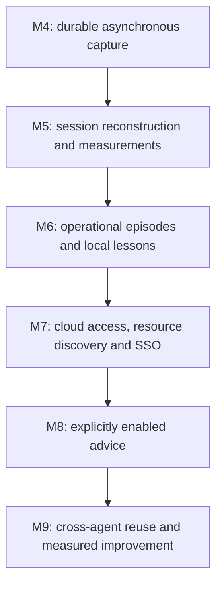

# Operational memory milestones

## Status

Draft, 2026-09-06. This is the canonical delivery index for the operational-memory pivot. Milestone names and linked specifications are proposed, not approved or implemented. Existing milestone completion records are unchanged. This index replaces P0–P5 as the planning sequence.

## Product contract

Passive AEL observes agent work, preserves eligible events asynchronously and derives local evidence-backed knowledge without injecting guidance, asking questions or blocking actions. Explicitly enabled advisory use is a later, separate capability. Existing platform permissions and independent runtime policies remain in force.

The durable learning unit is an operational episode: context, attempts, observed problem, correction or human intervention, and verified or unknown outcome. Reports expose evidence and gaps. A candidate is not an authoritative rule.

## Delivery order

M4–M7 are independently useful in passive mode. M8 introduces the first dependency on delivering advice to the acting agent. Measurement begins in M4/M5; M9 is the final comparative acceptance gate, not the start of measurement.

| Milestone | Deliverable | Specifications | Depends on | Exit evidence |
|---|---|---|---|---|
| M4 | Durable local queue and bounded background ingestion | [Asynchronous capture](../superpowers/specs/2026-09-06-m4-asynchronous-passive-capture-design.md) | Existing capture | Admitted events survive consumer failure; agent waits only for bounded admission |
| M5 | Reconstructed sessions, outcomes, coverage and baseline metrics | [Session evidence](../superpowers/specs/2026-09-06-m5-session-evidence-design.md) | M4 | Correlated timeline with explicit missing data; measured capture overhead |
| M6 | Passive episode analysis, tool-choice and command-repair candidates | [Operational learning](../superpowers/specs/2026-09-06-m6-operational-learning-design.md) | M5 | Local lesson persists with context and supporting evidence; no agent intervention |
| M7 | Resource-location/access knowledge and observed SSO episodes | [Resource discovery](../superpowers/specs/2026-09-06-m7-resource-discovery-design.md), [SSO](../superpowers/specs/2026-09-06-m7-sso-observation-design.md) | M6 | Both specs pass; correct resource scope and human-intervention classification |
| M8 | Opt-in advice, revalidation and usage attribution | [Advisory reuse](../superpowers/specs/2026-09-06-m8-advisory-reuse-design.md) | M6, M7 | Session B demonstrably receives and uses applicable knowledge from session A |
| M9 | Cross-agent scenarios and net-value release report | [Effectiveness benchmark](../superpowers/specs/2026-09-06-m9-effectiveness-benchmark-design.md) | M4–M8 | Behavioral, security, reliability, latency and token results against baseline |

## Mapping of the earlier proposal

| Earlier item | New ownership |
|---|---|
| P0: evidence, capture and baseline | M4 owns transport; M5 owns reconstruction and measurement |
| P1: tool choice and full loop | M6 owns learning; M8 owns delivery and reuse |
| P2: resource location and access | M7 resource spec owns observations; M8 owns advice |
| P3: SSO and human intervention | M7 SSO spec owns observations; M8 owns assistance |
| P4: repaired commands | M6 owns learning; M8 owns application |
| P5: reuse and effectiveness | M9, consuming measurements started in M4/M5 |

## Shared acceptance rules

- No passive component sends WARN, BLOCK, ask or contextual advice to an agent. Internal diagnostics are available on demand and omit raw private values.
- Hook success permits continuation; only durable queue admission acknowledges an event. These are different outcomes.
- Analysis cannot delay ingestion. Background work has bounded concurrency and resource budgets. No LLM, network or analysis runs in the admission path.
- Unknown is not success or failure. Missing outcomes, unsupported event classes, truncation and unavailable token metrics remain visible.
- Repository facts, project instructions, task-only instructions and user preferences have distinct provenance. Learned observations cannot silently override explicit instructions.
- Raw source text stays local. Queue, database, reports and exports each enforce privacy boundaries. No hidden reasoning or credentials become durable knowledge.
- Knowledge maintains existing lifecycle, dispute and Git authority rules. Advisory enablement does not enable new enforcement.
- A release needs scenario-level evidence as well as component tests. Existing `pnpm check` and affected regression suites remain required during implementation.

## Specification governance

Each linked document follows the [specification template](../sdd/spec-template.md). Open decisions are explicit and must be resolved before that specification becomes Approved. The user has requested organization and specifications, not implementation or blanket approval.

After approval, create the matching executable plan under `docs/superpowers/plans/`. Each implementation plan records requirement IDs, focused checks, migration/rollback verification and review evidence. Verification reports belong under `docs/verification/`. Do not infer milestone completion from passing unit tests alone.

The proposed queue/consumer boundary is recorded in [ADR 001](../decisions/001-asynchronous-passive-observation.md). Baseline specs 001–009 remain authoritative until an approved change explicitly amends them. In particular, ordered session ingestion must reconcile with spec 008's closed-session immutability before implementation.

## Historical evidence and priority

The initial user-visible AEL snapshot in this conversation contained seven non-test sessions and 483 events, with zero knowledge entries in the selected repositories. It was not a stable benchmark: the current session generated more events during inspection, and zero knowledge did not prove zero candidates. The code distinguishes passive event persistence, runtime failure capture and review-generated proposals.[^1]

The user supplied five operational problems: finding a cloud connection, encountering SSO, searching multiple Kubernetes environments/namespaces, repairing commands, and selecting the correct project tool. These are acceptance scenarios, not claims that identified local records already demonstrate them.

New TUI expansion, extra architecture/DX/PM reviewers and semantic retrieval remain below M4–M9 in this proposed sequence. Existing functionality is retained. Distribution work is separate and must not mislabel Draft features as shipped.

[^1]: [Passive persistence](../../src/capture/passive-service.ts), [runtime capture](../../src/capture/capture-service.ts), [review pipeline](../../src/review/review-service.ts). The source comparison and user clarification were recorded on 2026-09-06.
